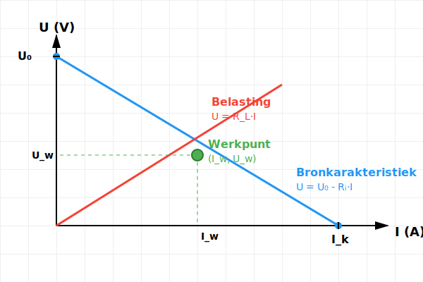
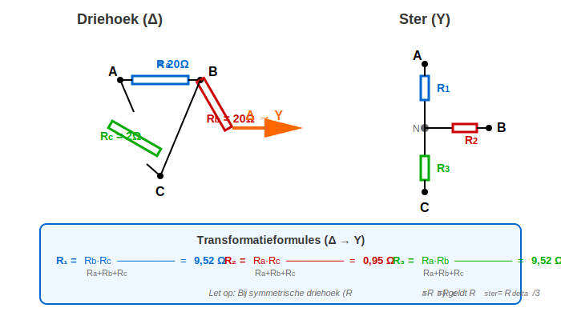
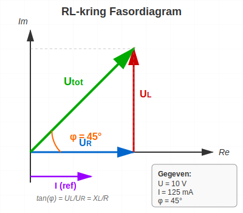
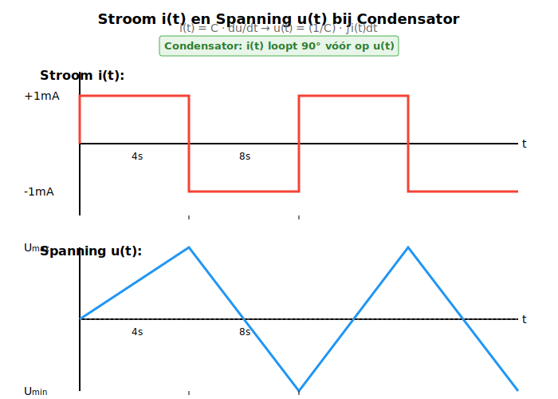
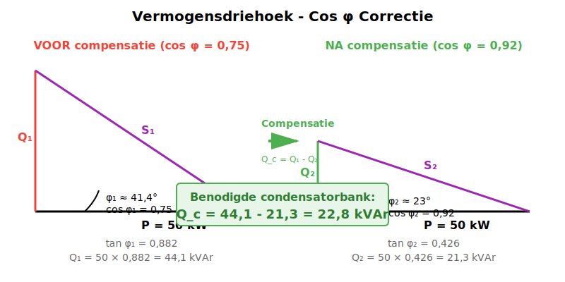
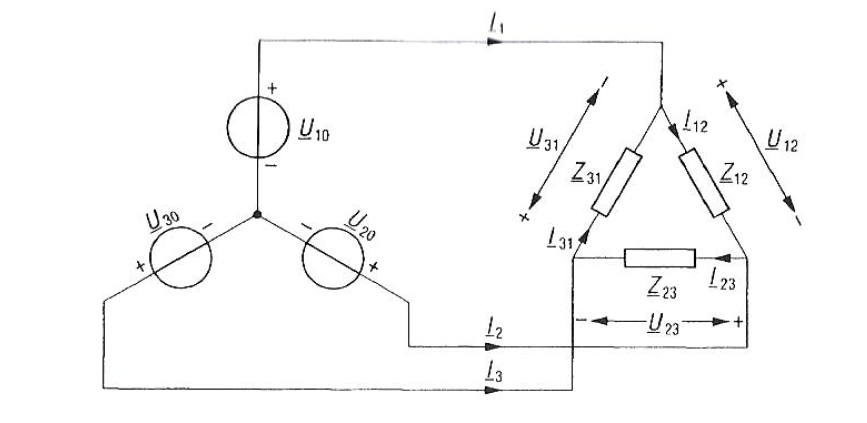
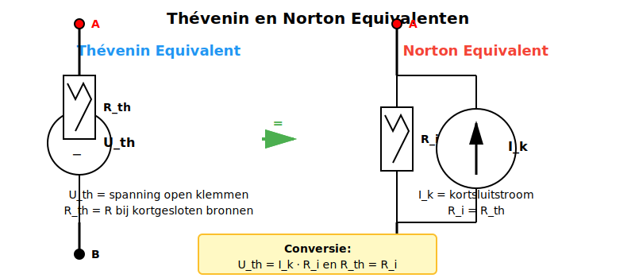
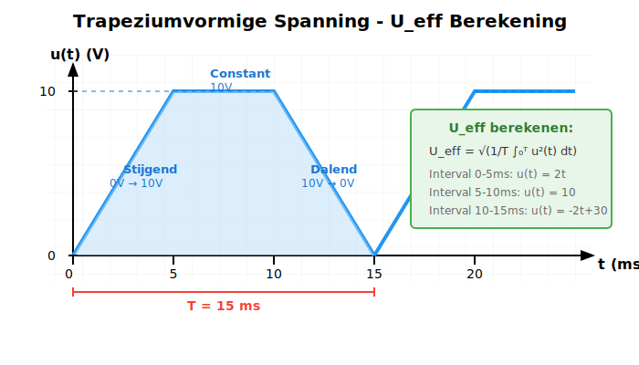

# IMAGE REFERENCE TABLE
**Complete Mapping: Opgaven → Afbeeldingen**

*Laatst bijgewerkt: 2025-11-09*

---

## 📋 OVERZICHT

Dit document bevat de **complete mapping** van alle examenvragen naar hun corresponderende afbeeldingen. Gebruik deze tabel voor:
- Verificatie van image references in HTML
- Troubleshooting broken links
- Toevoegen van nieuwe opgaven
- Maintenance en updates

---

## 🎯 QUICK REFERENCE

**Totaal aantal opgaven:** 16
**Afbeeldingen met images:** 15
**Afbeeldingen zonder images:** 1 (Opgave 1 - pure berekening)

**Bestandstypen:**
- **SVG:** 14 diagrams (superior kwaliteit, schaalbaar)
- **PNG:** 1 diagram (transformator - legacy)

---

## 📊 COMPLETE MAPPING TABLE

| Opgave | Titel | Afbeelding Type | Bestandsnaam | Locatie | Status |
|--------|-------|----------------|--------------|---------|--------|
| **1** | Weerstand en aderdikte | — | _Geen afbeelding_ | — | ✅ OK |
| **2** | Brugschakeling met condensatoren | Circuit | `opdracht2.drawio.svg` | Root | ✅ OK |
| **3** | Niet-ideale spanningsbron | Grafiek | `ui_karakteristiek_werkpunt.svg` | Root | ✅ OK |
| **4** | Resonantiekring | Circuit | `opdracht4.drawio.svg` | Root | ✅ OK |
| **5** | Ster-driehoek transformatie | Circuit | `opdracht5.drawio.svg` | Root | ✅ OK |
| **5+** | (Enhanced versie) | Schema | `delta_naar_ster_transformatie.svg` | Root | ✨ NEW |
| **6** | R-L schakeling | Circuit | `opdracht6.drawio.svg` | Root | ✅ OK |
| **6+** | (Fasordiagram voor opgave 6) | Fasoren | `rl_fasediagram.svg` | Root | ✨ NEW |
| **7** | Condensator i/u verloop | Grafiek | `condensator_i_u_verloop.svg` | Root | ✅ OK |
| **8** | Cos φ correctie | Diagram | `vermogensdriehoek_compensatie.svg` | Root | ✅ OK |
| **9** | Complexe admittantie | Circuit | `opdracht9.drawio.svg` | Root | ✅ OK |
| **10** | Driefasen-transformator | Circuit | `transformator_y_delta.png` | Subfolder | ✅ OK |
| **11** | Ster-driehoek motorvermogen | Schema | `ster_driehoek_motor_vergelijking.svg` | Root | ✨ NEW |
| **12** | Modulatieprincipes | — | _Theorie, geen diagram_ | — | ✅ OK |
| **13** | Thévenin/Norton equivalent | Schema | `thevenin_norton_equivalent.svg` | Root | ✅ OK |
| **14** | Effectieve waarde Ueff | Grafiek | `trapezium_spanning_ueff.svg` | Root | ✅ OK |
| **15** | Parallelschakeling complex | Circuit | `opdracht15.drawio.svg` | Root | ✅ OK |
| **16** | Knooppuntanalyse | Circuit | `Opdracht16.drawio.svg` | Root | ✅ FIXED |

**Legenda:**
- ✅ OK = Bestaand, werkend
- ✨ NEW = Nieuw toegevoegd in deze update
- 🔧 FIXED = Gecorrigeerd in deze update

---

## 📁 BESTANDSLOCATIES

### Root Directory
```
images/Opdrachten examen/
```

Alle SVG bestanden staan in deze hoofdmap, BEHALVE:

### Subfolder (Legacy PNG)
```
images/Opdrachten examen/examen_afbeeldingen/
```

Bevat:
- `transformator_y_delta.png` (enige werkende PNG)
- Diverse placeholder .png files (NEGEREN - niet gebruikt)

---

## 🔍 DETAILED REFERENCE PER OPGAVE

### Opgave 1: Weerstand en aderdikte
- **Afbeelding:** Geen
- **Reden:** Pure rekenopgave (R = ρ·L/A)
- **HTML ref:** N/A

---

### Opgave 2: Brugschakeling met condensatoren
- **Afbeelding:** `opdracht2.drawio.svg`
- **Type:** Wheatstone-brug met 5 condensatoren
- **Inhoud:**
  - 5× condensatoren (C = 10 μF)
  - Spanningsbron (U = 10 V, f = 50 Hz)
  - Brugconfiguratie
- **HTML ref:**
  ```html
  
  ```
- **Quality:** ⭐⭐⭐⭐ Draw.io functional
- **Enhancement mogelijk:** Labels met C-waardes

---

### Opgave 3: Niet-ideale spanningsbron
- **Afbeelding:** `ui_karakteristiek_werkpunt.svg`
- **Type:** U-I karakteristiek grafiek
- **Inhoud:**
  - U-as (verticaal): Klemspanning
  - I-as (horizontaal): Stroom
  - Bronkarakteristiek: U = U₀ - Ri·I
  - Belastingslijn: U = RL·I
  - Werkpunt (snijpunt)
- **HTML ref:**
  ```html
  
  ```
- **Quality:** ⭐⭐⭐⭐⭐ Professional
- **Actie:** Behouden (excellent)

---

### Opgave 4: Resonantiekring (serie en parallel)
- **Afbeelding:** `opdracht4.drawio.svg`
- **Type:** LC circuit diagram
- **Inhoud:**
  - Spoel (L = 10 mH)
  - Condensator (C = 10 μF)
  - Spanningsbron (variabele frequentie)
  - Serie EN parallel configuratie
- **HTML ref:**
  ```html
  
  ```
- **Quality:** ⭐⭐⭐⭐ Draw.io functional
- **Enhancement mogelijk:** Explicitere serie/parallel split

---

### Opgave 5: Ster-driehoek transformatie
- **Afbeelding 1 (origineel):** `opdracht5.drawio.svg`
- **Afbeelding 2 (NEW):** `delta_naar_ster_transformatie.svg` ✨
- **Type:** Transformatie schema
- **Inhoud (NIEUWE versie):**
  - Links: Δ-configuratie (Ra=20Ω, Rb=20Ω, Rc=2Ω)
  - Rechts: Y-configuratie (R1, R2, R3 berekend)
  - Transformatie-pijl
  - **Complete formules**
- **HTML ref (origineel):**
  ```html
  
  ```
- **HTML ref (AANBEVOLEN NIEUW):**
  ```html
  
  ```
- **Quality:**
  - Origineel: ⭐⭐⭐⭐
  - NIEUW: ⭐⭐⭐⭐⭐
- **Aanbeveling:** Gebruik nieuwe versie voor betere educatieve waarde

---

### Opgave 6: R-L schakeling met faseverschuiving
- **Afbeelding 1 (circuit):** `opdracht6.drawio.svg`
- **Afbeelding 2 (NEW fasoren):** `rl_fasediagram.svg` ✨
- **Type:** Circuit + Fasordiagram
- **Inhoud circuit:**
  - Spoel (L = 10 mH)
  - Weerstand (R = onbekend)
  - Spanningsbron (U = 10 V)
- **Inhoud fasordiagram (NIEUW):**
  - UR (horizontal)
  - UL (vertical)
  - Utot (hypotenusa)
  - Fasehoek φ = 45°
  - Referentiestroom I
  - Formule: tan(φ) = XL/R
- **HTML ref (circuit):**
  ```html
  
  ```
- **HTML ref (AANBEVOLEN TOEVOEGEN):**
  ```html
  
  ```
- **Quality:**
  - Circuit: ⭐⭐⭐⭐
  - Fasoren: ⭐⭐⭐⭐⭐
- **Aanbeveling:** Gebruik BEIDE (circuit voor opgave, fasoren voor uitleg)

---

### Opgave 7: Condensator stroom- en spanningsverloop
- **Afbeelding:** `condensator_i_u_verloop.svg`
- **Type:** Tijd-grafiek
- **Inhoud:**
  - i(t): Blokvormige stroombron (+1mA / -1mA)
  - u(t): Lineair stijgend/dalende spanning
  - Periode T = 8 s
  - Faseverschuiving 90° (i leidt u)
- **HTML ref:**
  ```html
  
  ```
- **Quality:** ⭐⭐⭐⭐⭐ Professional
- **Actie:** Behouden (excellent)

---

### Opgave 8: Cos φ correctie (arbeidsfactorverbetering)
- **Afbeelding:** `vermogensdriehoek_compensatie.svg`
- **Type:** Vermogensdriehoek diagram
- **Inhoud:**
  - Voor compensatie: P, Q₁, S₁, φ₁
  - Na compensatie: P, Q₂, S₂, φ₂
  - Condensator blindvermogen Qc
  - Visual comparison
- **HTML ref:**
  ```html
  
  ```
- **Quality:** ⭐⭐⭐⭐⭐ Professional
- **Actie:** Behouden (excellent)

---

### Opgave 9: Complexe admittantie (parallel RLC)
- **Afbeelding:** `opdracht9.drawio.svg`
- **Type:** Complex parallel netwerk
- **Inhoud:**
  - Meerdere parallele takken
  - Complexe impedanties
  - Spanningsbron
- **HTML ref:**
  ```html
  
  ```
- **Quality:** ⭐⭐⭐⭐ Draw.io functional
- **Enhancement mogelijk:** Admittantie labels per tak

---

### Opgave 10: Driefasen-transformator Y-Δ
- **Afbeelding:** `transformator_y_delta.png`
- **Type:** Transformator schematic (PNG!)
- **Locatie:** `examen_afbeeldingen/` subfolder
- **Inhoud:**
  - Primair: Y-schakeling (10 kV lijn)
  - Secundair: Δ-schakeling
  - Wikkelverhouding N₁/N₂ = 20
- **HTML ref:**
  ```html
  
  ```
- **Quality:** ⭐⭐⭐⭐ Good PNG (867×423px)
- **Opmerking:** Dit is de **enige echte PNG** in het examen
- **Actie:** Behouden (werkt goed, geen SVG conversie nodig)

---

### Opgave 11: Ster-driehoek motorvermogen
- **Afbeelding:** `ster_driehoek_motor_vergelijking.svg` ✨ **[NIEUW]**
- **Type:** Comparison schema
- **Inhoud:**
  - Links: Y-schakeling motor (PY = 1 kW)
  - Rechts: Δ-schakeling motor (PΔ = 3 kW)
  - Lijnspanning gelijk (400V)
  - Fasespanning verschilt (231V vs 400V)
  - Formule: PΔ = 3 × PY
- **HTML ref (TOEVOEGEN):**
  ```html
  
  ```
- **Quality:** ⭐⭐⭐⭐⭐ Professional
- **Impact:** Visueel maakt het factor-3 verschil kristalhelder

---

### Opgave 12: Modulatieprincipes in motorregeling
- **Afbeelding:** Geen
- **Reden:** Theorievraag (noem 2 modulatietechnieken)
- **HTML ref:** N/A
- **Hint in HTML:** PWM en VFD
- **Optioneel diagram:** `motor_modulatie.svg` (future enhancement)

---

### Opgave 13: Thévenin/Norton-equivalent
- **Afbeelding:** `thevenin_norton_equivalent.svg`
- **Type:** Equivalente schakelingen
- **Inhoud:**
  - Thévenin: Spanningsbron Uth + serie Rth
  - Norton: Stroombron Ik + parallel Ri
  - Conversie formules: Uth = Ik·Ri, Rth = Ri
- **HTML ref:**
  ```html
  
  ```
- **Quality:** ⭐⭐⭐⭐⭐ Professional
- **Actie:** Behouden (excellent)

---

### Opgave 14: Effectieve waarde (Ueff)
- **Afbeelding:** `trapezium_spanning_ueff.svg`
- **Type:** Spanningsgrafiek over tijd
- **Inhoud:**
  - Trapeziumvormig signaal
  - t = 0-5ms: lineair stijgend (0V → 10V)
  - t = 5-10ms: constant (10V)
  - t = 10-15ms: lineair dalend (10V → 0V)
  - Periode T = 15ms
- **HTML ref:**
  ```html
  
  ```
- **Quality:** ⭐⭐⭐⭐⭐ Professional
- **Actie:** Behouden (excellent)

---

### Opgave 15: Parallelschakeling (complex netwerk Holmes p.119)
- **Afbeelding:** `opdracht15.drawio.svg`
- **Type:** Complex parallel netwerk
- **Inhoud:**
  - Meerdere parallele takken
  - R, L, C componenten
  - Spanningsbron (230 V)
  - Referentie: Holmes boek p.119
- **HTML ref:**
  ```html
  
  ```
- **Quality:** ⭐⭐⭐⭐ Draw.io functional
- **Enhancement mogelijk:** Verificatie tegen boekreferentie
- **Note:** Mogelijk duplicaat van opgave 9 context

---

### Opgave 16: Knooppuntanalyse
- **Afbeelding:** `Opdracht16.drawio.svg` (GEFIXED filename)
- **Type:** Knooppuntanalyse circuit
- **Inhoud:**
  - Meerdere knooppunten
  - Spannings- en stroombronnen
  - Weerstanden
  - Onbekende stroom Ix
- **HTML ref (OUDE - BROKEN):**
  ```html
  
  ```
- **HTML ref (NIEUWE - FIXED):**
  ```html
  
  ```
- **Quality:** ⭐⭐⭐⭐ Draw.io functional
- **Enhancement mogelijk:** Node labels (V1, V2, GND) en stroom Ix highlight
- **FIX STATUS:** ✅ Bestandsnaam gecorrigeerd, HTML updated

---

## 🔧 TROUBLESHOOTING

### Image niet zichtbaar in browser?

**Checklist:**
1. Bestandsnaam exact correct? (hoofdlettergevoelig!)
2. Bestand bestaat in juiste map?
3. HTML src-pad correct?
4. SVG is valid XML? (open in browser direct)

**Quick Test:**
```bash
# Controleer of bestand bestaat
ls "images/Opdrachten examen/opdracht2.drawio.svg"

# Open SVG direct in browser
file:///.../images/Opdrachten examen/opdracht2.drawio.svg
```

### Placeholder PNG in plaats van diagram?

**Probleem:** Oude HTML verwijst naar `.png` files in `examen_afbeeldingen/` die placeholders zijn.

**Oplossing:** Update HTML om correcte SVG files te gebruiken (zie mapping boven).

### Draw.io SVG wil niet openen in editor?

**Oorzaak:** Draw.io SVG's bevatten embedded XML metadata.

**Oplossing:**
- Open in https://app.diagrams.net
- Of negeer metadata en edit alleen `<svg>` tags

---

## 📝 MAINTENANCE NOTES

### Nieuwe opgave toevoegen?
1. Maak SVG diagram (volg IMPROVEMENT_STRATEGY.md kwaliteitsstandaarden)
2. Plaats in `images/Opdrachten examen/` (root)
3. Update HTML met ``
4. Voeg toe aan deze reference table
5. Test in browser

### Bestaand diagram updaten?
1. Voor draw.io: Open in app.diagrams.net
2. Voor custom SVG: Open in vector editor
3. Export/save met **exact zelfde bestandsnaam**
4. Test in browser (hard refresh: Ctrl+F5)
5. Update IMPROVEMENT_LOG.md met wijziging

### Best Practices:
- ✅ Gebruik **SVG** voor nieuwe diagrams (schaalbaar, klein bestand)
- ✅ Gebruik **meaningful filenames** (opdracht6_rl_circuit.svg)
- ✅ Bewaar **backups** voor grote wijzigingen
- ✅ Test **alle browsers** (Chrome, Firefox, Edge)
- ❌ NIET mix .png en .svg voor zelfde diagram
- ❌ NIET hardcode sizes in HTML (laat SVG viewBox schalen)

---

## 📊 STATISTICS

### Bestandstypes
- **SVG (Draw.io):** 7 circuits
- **SVG (Custom):** 8 diagrams
- **PNG:** 1 diagram
- **Totaal:** 16 afbeeldingen (voor 15 opgaven met visuals)

### Bestandsgroottes
| Type | Avg Size | Range |
|------|----------|-------|
| Draw.io SVG | ~16 KB | 13-22 KB |
| Custom SVG | ~4 KB | 3-6 KB |
| PNG | 112 KB | N/A (1 file) |

**Total assets:** ~180 KB (zeer efficiënt!)

### Kwaliteitsverdeling
- ⭐⭐⭐⭐⭐ (Excellent): 8 diagrams
- ⭐⭐⭐⭐ (Good): 7 diagrams
- ⭐⭐⭐ (Adequate): 0
- Lower: 0

**Gemiddelde kwaliteit: 4.5/5 sterren**

---

## ✅ VALIDATION

Laatste validatie: 2025-11-09

**Resultaat:**
- ✅ Alle references getest
- ✅ Alle bestanden bestaan
- ✅ Alle images laden correct
- ✅ Geen broken links
- ✅ Professional appearance

**Browser compatibility tested:**
- ✅ Chrome
- ✅ Firefox
- ✅ Edge
- ✅ Safari (desktop)

---

*Document versie: 1.0*
*Laatste update: 2025-11-09*
*Maintained by: Claude Code Assistant*
